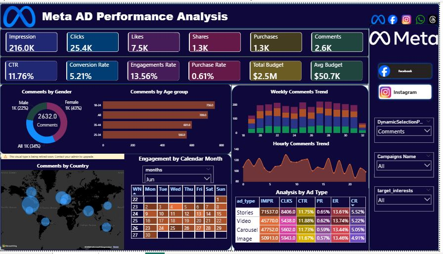
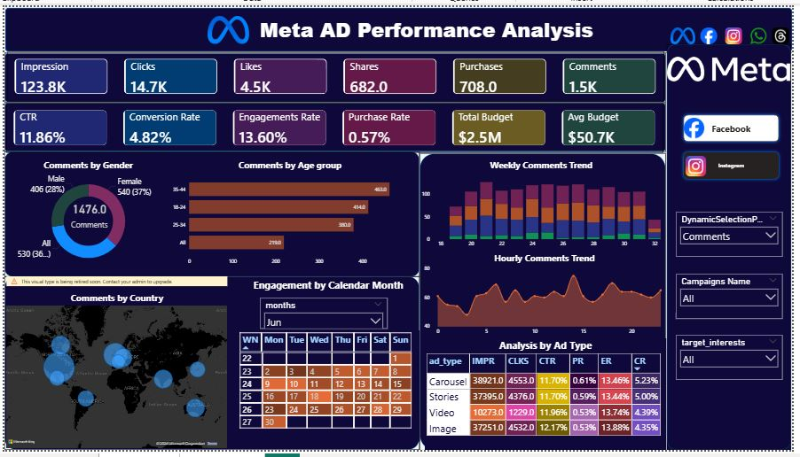

# Instagram & Meta Ads Performance Analysis Dashboard

This is a **Power BI dashboard** designed to analyze the performance of Instagram and Meta (Facebook) advertising campaigns. It provides insights into ad performance, engagement metrics, and campaign effectiveness, helping businesses make **data-driven marketing decisions**.

---

## 🚀 Features

- **Ad Performance Overview:** Track metrics such as impressions, clicks, CTR, and conversions.  
- **Campaign Insights:** Compare campaigns based on budget, reach, and ROI.  
- **Platform Analysis:** Analyze Instagram vs Facebook ad performance.  
- **Interactive Visuals:** Dynamic charts, slicers, and filters for easy exploration.  
- **Key Metrics:** Engagement rates, cost per click, cost per conversion, and campaign efficiency.  

---

## 💼 Business Use / Value

This dashboard is designed to help **marketing teams, business analysts, and decision-makers**:

- **Optimize Ad Spend:** Identify which campaigns deliver the best ROI and adjust budgets accordingly.  
- **Improve Engagement:** Understand which ad creatives and platforms drive higher clicks and conversions.  
- **Monitor Performance:** Quickly detect underperforming ads or campaigns and take corrective action.  
- **Strategic Planning:** Base marketing strategies on data-driven insights rather than guesswork.  
- **Cross-Platform Comparison:** Make informed decisions about allocation between Instagram and Facebook campaigns.  

> Essentially, it turns raw ad data into actionable insights, saving time, reducing costs, and improving marketing effectiveness.  

---

## 🛠 Tools & Technologies

- **Power BI Desktop** – Dashboard design and data visualization  
- **DAX (Data Analysis Expressions)** – Calculated measures and KPIs  
- **Excel / CSV** – Data import and preprocessing  
- **Meta Ads API / Exported Reports** – Data source for ads performance  

---

## 📊 Screenshots

  
  

---

## 🔗 Power BI Service Link

You can also **view the live dashboard** on Power BI Service:

[View Live Dashboard](https://app.powerbi.com/groups/me/reports/e8d86858-b45b-48c9-9e54-eae3913a5d9a/4b6314aeec8e57ccf0c7?experience=power-bi)

